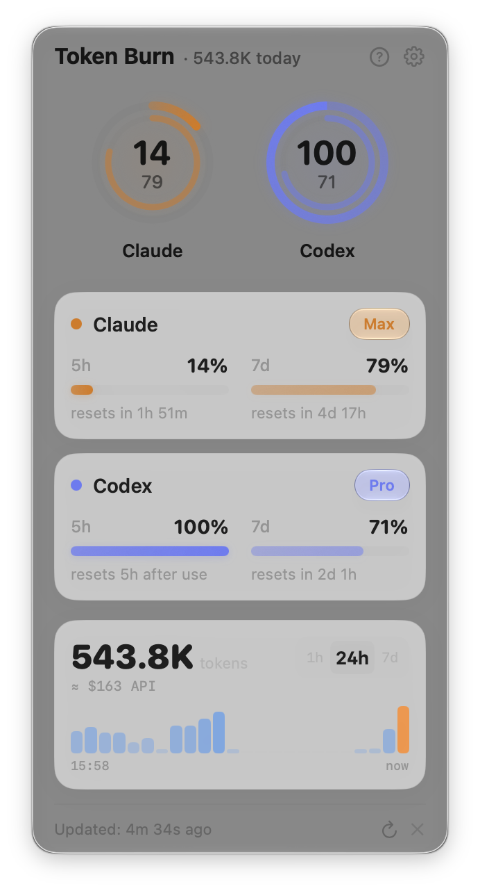
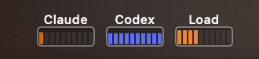
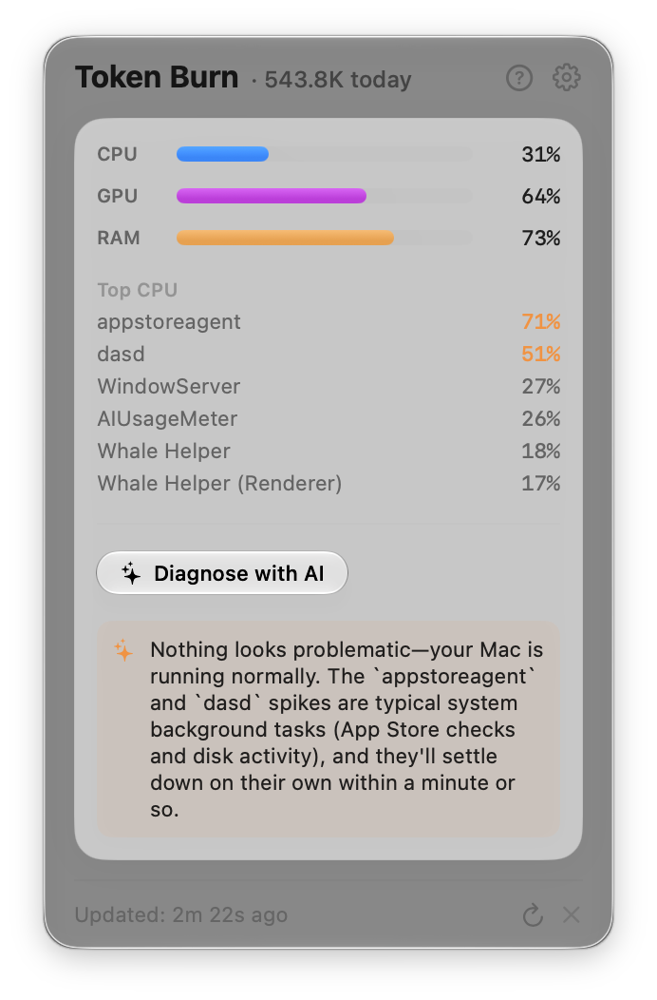
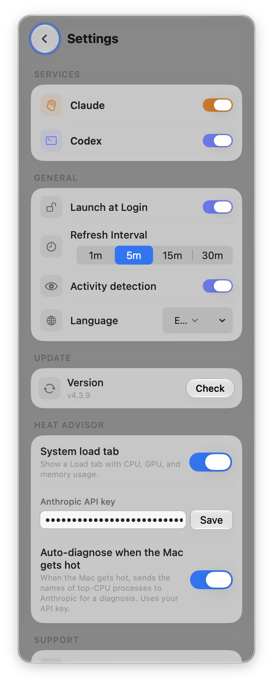

<div align="center">

# Token Burn

**See what your AI agents are burning — right from the menu bar.**

Remaining quota, token burn, and system load for Claude Code & Codex, one glance away.

[](https://www.apple.com/macos/)
[](https://swift.org)
[](LICENSE)
[](../../releases)
[](../../releases)

<br>


</div>

<br>

## Why

Agent sessions quietly eat through your 5-hour and weekly quotas while you work — and you usually find out the moment you hit the wall. Token Burn keeps the remaining budget in sight at all times, and shows how hard your Mac is working while the agents run.

## In the Menu Bar



Each service cell encodes two things at once:

- **Horizontal fill** → 5-hour quota remaining
- **Bar height** → 7-day quota remaining

While an agent is actively calling APIs, the bars pulse with a heartbeat animation. An optional **system-load meter** (CPU × GPU, RAM as color) sits alongside — like a tiny activity monitor for agent workloads. Clicking a cell jumps straight to that view in the panel.

## In the Panel

- **Circular gauges** per service — 5h / 7d remaining with reset countdown (*"3h 38m until reset"*)
- **Token Burn chart** — 1h / 24h / 7d scope, switch by trackpad scroll, with cache-aware API-equivalent cost estimates
- **System Load tab** — CPU × GPU gauge with RAM as color, top processes, and a glanceable heat strip on the main panel
- **Heat advisor** *(optional)* — when your Mac runs hot, sends the top CPU process names to Claude using **your own** Anthropic API key and tells you what's cooking
- **Staleness flags** — warns when a service stopped reporting fresh data

<div align="center">

</div>

## Install

```bash
brew install --cask multi-turn-inc/tap/token-burn
```

Or grab the latest `.dmg` from [Releases](../../releases).

**Requirements:** macOS 26 (Tahoe) or later, with [Claude Code](https://docs.anthropic.com/en/docs/claude-code) or [Codex CLI](https://github.com/openai/codex) installed and authenticated.

## How It Works

Token Burn reuses the OAuth credentials your CLI tools already have. **It never asks for API keys or passwords.**

| Service | Credential source | Token source |
|---------|-------------------|--------------|
| Claude | Keychain / `~/.claude/.credentials.json` | `~/.claude/projects/**/*.jsonl` |
| Codex | `~/.codex/auth.json` | `~/.codex/sessions/**/*.jsonl` |

- Quota comes from each provider's usage API; token counts come from parsing local session logs in a single streaming pass
- Replayed and resumed history is deduplicated (ccusage-style accounting) — counts `input + output` tokens, matching Claude's `/stats`
- Expired tokens are refreshed via the standard OAuth flow; deleted credential files are restored from Keychain
- Everything stays local — logs are parsed on your machine and never uploaded

## Privacy & Security

This app is a **read-only viewer**, built to be paranoid about your tokens:

- OAuth tokens are only ever sent to each provider's own API hosts (hard allowlist — a tampered config file can't redirect them)
- Credential files are written with `0600` permissions; the app never stores secrets of its own
- The optional heat advisor is the only other network call, and it's off until you provide your own API key
- Auto-update is triple-checked: Ed25519-signed Sparkle feed, notarization assessment, and Developer ID pinning — with downgrade protection

## More

- Auto-refresh every 1 / 5 / 15 / 30 minutes
- Auto-update via GitHub Releases
- 10 languages — EN, KO, JA, ZH, ES, FR, DE, PT, RU, IT
- Native SwiftUI with Liquid Glass on macOS Tahoe

<details>
<summary>Settings</summary>
<br>

</details>

## Development

```bash
git clone https://github.com/multi-turn-inc/ai-usage-meter.git
cd ai-usage-meter
swift build            # debug build
swift test             # parser regression suite
./scripts/build-app.sh <version>   # signed .app + DMG + local install
```

Parsing logic lives in the `AIUsageMeterCore` library target so it stays testable in isolation. Third-party licenses are listed in [docs/THIRD_PARTY_NOTICES.md](docs/THIRD_PARTY_NOTICES.md).

## License

[MIT](LICENSE)
